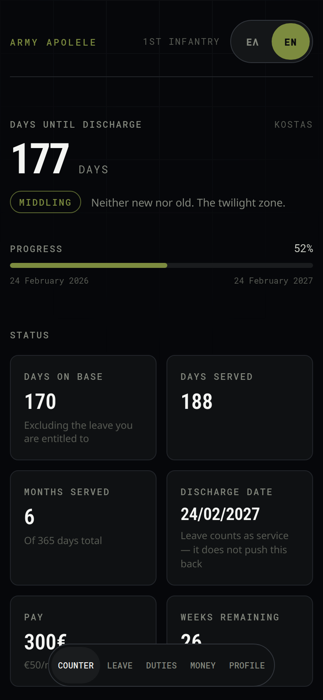
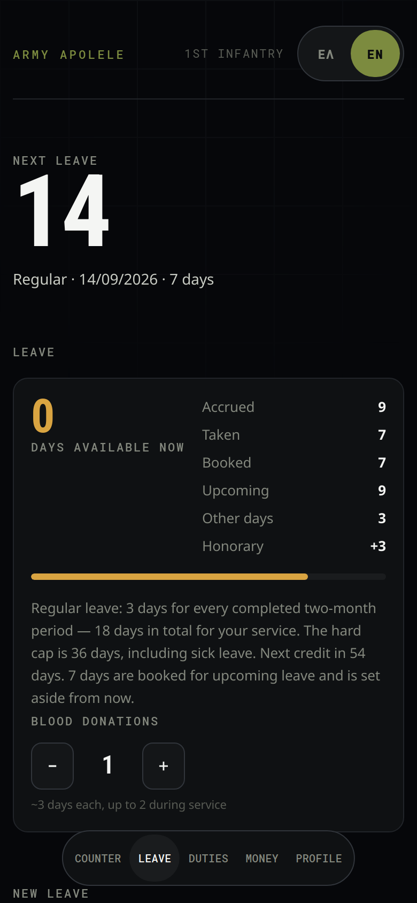
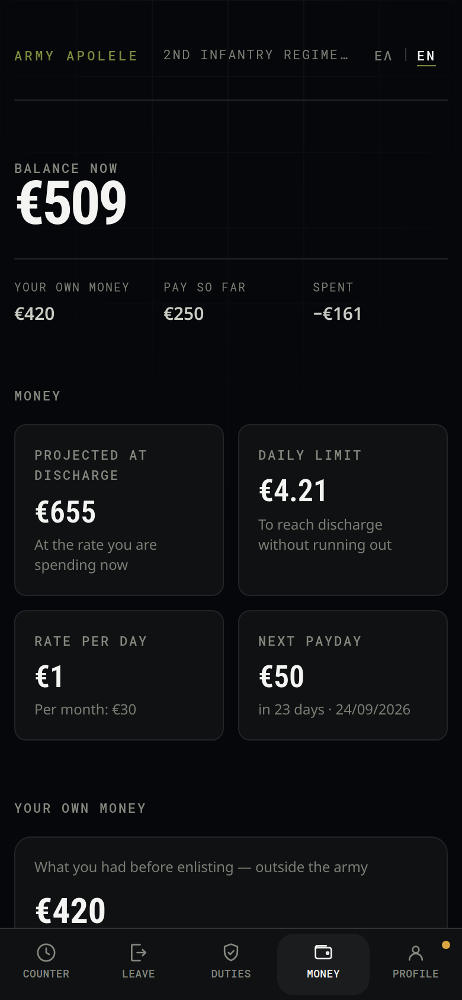
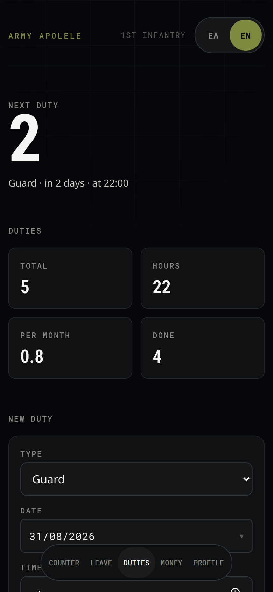
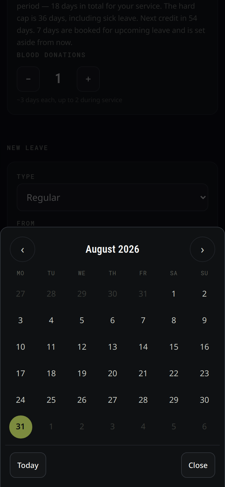
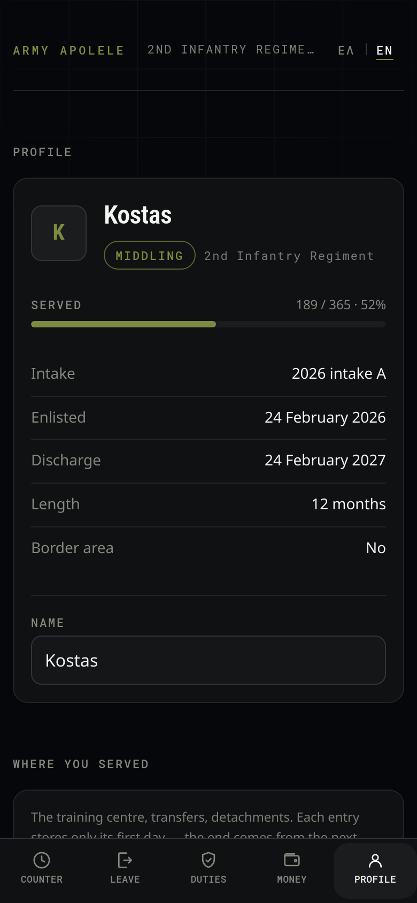

<h1 align="center">Army Apolele</h1>

<p align="center">
  <strong>A countdown for Greek military service.</strong><br>
  Days until discharge, leave, duties and money — offline, bilingual, installable.
</p>

<p align="center">
  <a href="https://army-apolele.web.app"><strong>Open the app →</strong></a>
</p>

<p align="center">
  Designed and built by <strong>Konstantinos Kotsaras</strong>
</p>

<p align="center">
  
  
  
</p>

---

Greek conscription changed on **1 January 2026** under Law 5265/2026: four intakes
a year instead of six, everyone serving in the Army, a new leave formula. This app
encodes those rules and answers the only question that matters day to day — *how
long is left*.

It is **bilingual** (Greek and English), works **entirely offline**, and installs
to the home screen as a PWA. An account is optional and exists solely to sync
between devices. The screenshots above and below show the English interface.

## Features

| | |
|---|---|
| **Counter** | Days until discharge, progress, days actually on base, pay earned, and a rank tier that goes from *Newbie* to *Short-timer* |
| **Leave** | Entitlement accrual, leave recorded by date with type, a countdown to the next one, and days taken kept separate from days booked |
| **Duties** | Guard shifts and fatigues with time and length, next-duty countdown, totals per type, and an average per month |
| **Money** | Allowance, expenses by category, recurring charges that post themselves, a projection to discharge and a daily limit |
| **Profile** | Service record at a glance, local notifications, JSON backup, and optional cross-device sync |

<p align="center">
  
  
  
</p>

Alongside those: a privacy page, a custom 404, success and error messaging on
every action, and a confirmation step before anything is deleted.

## Quick start

```bash
npm install
npm run dev      # http://localhost:5173
npm test         # domain logic and dictionary parity
npm run build
npm run audit    # real-browser checks — see scripts/README.md
```

Node 20 or newer. No configuration is required to run it: without Firebase
credentials the app simply stores everything locally.

## The rules it encodes

Every constant lives in [`src/lib/service.ts`](src/lib/service.ts) with a name, so
that a change in the law is a change in one place:

- **Length** — 12 months in full; 9 months for Thrace, the East Aegean islands,
  the Presidential Guard and ELDYK; 6 and 3 months for reduced obligation.
- **Intakes** — four a year rather than six: February, May, August, November. The
  2026 A intake is confirmed (24–27 February 2026); the rest are flagged as
  *estimates* in [`src/lib/esso.ts`](src/lib/esso.ts) until each official call-up
  is published.
- **Branch** — since 1 January 2026 every conscript joins the Army, which is why
  the app never asks.
- **Leave** — 3 days for every completed two-month period (18 for a twelve-month
  term), capped at 36 including sick leave; roughly 3 honorary days per blood
  donation, up to twice; 2 days per completed month in a border unit.
- **Pay** — €50 a month, €100 in a border unit.
- **Training** — 10 weeks of basic training, 14 weeks in total before posting.

One consequence is worth stating because it surprises people: the discharge date
is `enlistment + months of obligation`. **Leave counts as service**, so it never
pushes discharge back. What it moves is the number of days you are physically on
base — which is why that appears as its own figure.

## Engineering notes

A few decisions that shaped the codebase.

**Money is stored as integer cents.** In floating point `0.1 + 0.2` is not `0.3`,
and after a few dozen entries a balance would be visibly wrong. A test asserts the
exact sum.

**A missing translation is a compile error.** The English dictionary is declared
as `const en: typeof el`, so omitting a key fails the build rather than rendering
a blank string in production. Tests additionally assert that neither dictionary
contains an empty string.

**Domain modules return keys, not text.** `service`, `duty`, `leave` and `ranks`
hand back identifiers; translation happens in components. The calculations are
therefore language-independent, and `src/lib/` has no React dependency at all —
it would port unchanged to React Native or a Cloud Function.

**Greek uppercase drops the accent.** `ΥΠΟΛΟΓΙΣΤΗΣ`, not `ΥΠΟΛΟΓΙΣΤΉΣ` — unless
the accent falls on the first letter, where it stays. CSS `text-transform` gets
this wrong, so every capitalisation goes through
[`src/lib/greek.ts`](src/lib/greek.ts) and no stylesheet carries a
`text-transform: uppercase` rule.

**Syncing merges lists instead of overwriting them.** Two devices editing offline
would lose entries under last-write-wins, so lists are merged by `id` and
deletions leave tombstones — see [`src/lib/merge.ts`](src/lib/merge.ts).

**The date picker is custom.** A native `<input type="date">` renders month/day
order according to the browser's locale rather than the page's, so Chrome on
desktop showed American dates in a Greek interface. The replacement is a sheet of
circular day buttons, laid out so each tap target stays above 44px even at 320px
wide.

## Mobile

- No horizontal scrolling on any screen from 320px up, verified in a real browser.
- Zoom is locked (`user-scalable=no`). So that zoom is never *needed*: every input
  is 16px — below that iOS Safari zooms on focus — and every tap target is at
  least 44px.
- `touch-action: manipulation`, so a double tap does not magnify.
- Safe-area insets are respected, with a separate layout for short landscape
  windows.

> **Accessibility note.** Locking zoom violates WCAG 2.1 (1.4.4), which requires
> magnification up to 200%. It was done on request. To restore it, remove
> `maximum-scale=1, user-scalable=no` from [`index.html`](index.html) — nothing
> else depends on it.

## Testing

```bash
npm test           # domain logic, formatting, merge behaviour, dictionaries
npm run audit      # six browser suites
```

The browser suites run against a production build in headless Chromium and cover
mobile layout at five widths, end-to-end interaction, Greek glyph coverage, PWA
installability and offline start-up, scrolling, and notifications, share cards and
backups. Details in [`scripts/README.md`](scripts/README.md).

The font suite exists because of a real failure: Oswald has no Greek glyphs and
fell back silently, so a Greek heading rendered in a serif nobody chose.

## Project layout

```
src/lib/          domain logic, no React — dates, service, leave, duty, money,
                  merge, notify, share, backup, calendar, greek, i18n
src/components/   UI, including Privacy, NotFound, Toasts, ErrorBoundary
src/hooks/        useI18n, useToast, useProfile, useAuth, useRoute, useToday
src/firebase/     config, auth, sync — inert until credentials are supplied
src/styles/       tokens, global, app
tests/            domain and dictionary checks
scripts/          browser audits, icon generation, service-worker build step
DESIGN.md         the design system
```

## Firebase

The app is **local-first**: it works fully without an account and without a
network. Firebase is an optional layer on top — email or Google sign-in, and
profile sync across devices.

To run it against your own project:

```bash
cp .env.example .env.local   # fill in from Firebase Console → Project settings
npx firebase use --add       # select your project
npx firebase deploy --only firestore:rules
npm run deploy               # build and deploy hosting
```

Without `.env.local` every Firebase path stays inert: the SDK is imported
dynamically and `isFirebaseConfigured()` returns `false`, so the app runs normally
on local storage alone.

Schema is `users/{uid}`, one document per user.

### Security

The Firebase `apiKey` **is not a secret**. It is bundled into the JavaScript and
visible to anyone who opens developer tools — that is how every Firebase web app
works. It identifies the project; it does not protect it.

Protection comes from two things:

1. **[`firestore.rules`](firestore.rules)** — each user can read and write only
   their own document. This is what actually keeps data safe.
2. **Key restrictions** — in the Google Cloud console, application restrictions to
   specific domains and API restrictions to the APIs actually in use. This limits
   abuse; it does not replace the first.

`.env.local` and `.firebaserc` are gitignored — not because they hold secrets, but
because they point at one particular project.

## Design

See [DESIGN.md](DESIGN.md). The system mixes two references from
[awesome-design-md](https://github.com/VoltAgent/awesome-design-md): the
**structure** of Linear — near-black canvas, hairline-bordered panels, a single
accent — and the **voice** of SpaceX, one enormous numeral per screen above
tracked uppercase microtext. Linear's lavender is replaced by field olive, with an
amber signal reserved for the final phase of service.

Typefaces are Roboto Condensed and Roboto Mono because they **must cover Greek**.

## Privacy

Without an account, no data leaves the device: no tracking, no analytics, no
advertising. Signing in stores the profile in Firestore in a document readable
only by that account. The full text is at `/privacy` in the app, in both
languages.

## Author

**Konstantinos Kotsaras** — [@kotsarakos](https://github.com/kotsarakos)

Written while waiting for my own call-up papers, which is why the app answers the
questions a conscript actually asks rather than the ones a calendar would.

No licence is granted. The source is public so that the calculations can be
checked against the law, not so that the app can be republished.

## Disclaimer

Informational only, and not affiliated with the Hellenic Army General Staff or the
Ministry of National Defence. Your official discharge date is set by your unit.
